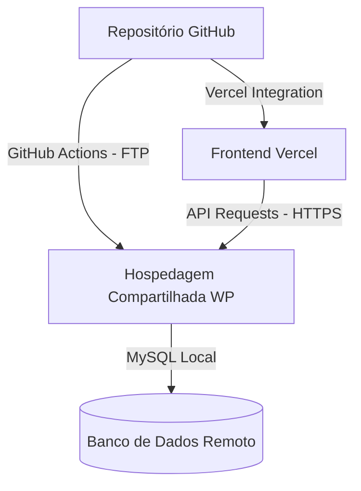

# 📋 Plano de Implementação: CI/CD & Deploy (Fase 5)
O objetivo deste documento é definir a estratégia de deploy contínuo (CI/CD) para o **TIWEB - SPED Fácil**, considerando um cenário de hospedagem compartilhada sem SSH para o WordPress (Backend) e a Vercel para a SPA Angular (Frontend).

---

## 🎯 1. Objetivos e Contexto de Infraestrutura



* **Backend (WordPress):** Rodando em hospedagem compartilhada sem SSH. O deploy de arquivos será feito via **FTP (GitHub Actions)** e a migração de banco será integrada no ciclo de vida do WordPress.
* **Frontend (Angular SPA):** Hospedado gratuitamente na **Vercel**, consumindo a API do WordPress remotamente através de URLs absolutas (HTTPS).

---

## 🚨 2. Pontos Críticos e Atenção Requerida

> [!IMPORTANT]
> **CORS (Cross-Origin Resource Sharing)**
> Como a Vercel e o WordPress rodarão em domínios diferentes (ex: `sped-facil.vercel.app` vs `tiweb.app.br`), o WordPress precisará enviar headers CORS permitindo requisições do domínio da Vercel. Isso será tratado no arquivo `.htaccess` e nos hooks do plugin customizado.

> [!WARNING]
> **Configurações do Google Console**
> A chave do Google Login precisará ter o domínio da Vercel (`https://sped-facil.vercel.app`) adicionado como "Origem JavaScript Autorizada" (Authorized JavaScript Origins) nas credenciais do console do Google Developer.

---

## 📝 3. Mudanças Propostas e Componentes

### 📂 Componente A: Ajuste de Environments no Frontend
Atualmente, o script `set-env.js` sobrescreve os environments locais e de produção, mas **não gera a propriedade `graphqlUrl`**. Além disso, em produção na Vercel precisaremos de URLs absolutas.

#### [MODIFY] `frontend-angular/scripts/set-env.js`
Atualizar o gerador para suportar `graphqlUrl` e permitir URLs dinâmicas para a produção na Vercel:

```javascript
const { writeFileSync } = require('fs');
require('dotenv').config();

const targetPathProduction = './src/environments/environment.ts';
const targetPathDevelopment = './src/environments/environment.development.ts';

// 1. Chave do Google Client
const googleClientId = process.env.GOOGLE_CLIENT_ID || '1018169699705-vgvkpisbmjgrvudab5mrdnsvgid7bjk7.apps.googleusercontent.com';

// 2. URLs do Backend (Dev e Produção)
const apiUrlDev = process.env.API_URL || 'http://localhost:8080/wp-json';
const graphqlUrlDev = process.env.GRAPHQL_URL || (apiUrlDev.endsWith('/wp-json') ? apiUrlDev.replace('/wp-json', '/graphql') : 'http://localhost:8080/graphql');

// Na Vercel, o API_URL de produção virá das variáveis de ambiente da plataforma
const apiUrlProd = process.env.API_URL_PROD || '/wp-json';
const graphqlUrlProd = process.env.GRAPHQL_URL_PROD || (apiUrlProd.endsWith('/wp-json') ? apiUrlProd.replace('/wp-json', '/graphql') : '/graphql');

const envConfigFileProduction = `export const environment = {
  production: true,
  googleClientId: '${googleClientId}',
  apiUrl: '${apiUrlProd}',
  graphqlUrl: '${graphqlUrlProd}'
};
`;

const envConfigFileDevelopment = `export const environment = {
  production: false,
  googleClientId: '${googleClientId}',
  apiUrl: '${apiUrlDev}',
  graphqlUrl: '${graphqlUrlDev}'
};
`;

writeFileSync(targetPathProduction, envConfigFileProduction);
writeFileSync(targetPathDevelopment, envConfigFileDevelopment);

console.log('✅ Arquivos de environment gerados com sucesso!');
```

---

### 📂 Componente B: CI/CD do Backend via FTP
Como a hospedagem não possui SSH, usaremos o **FTP Deploy Action** no GitHub Actions para sincronizar apenas os arquivos que pertencem ao nosso código versionado, evitando mexer nos arquivos do core do WordPress.

#### [NEW] `.github/workflows/deploy-backend.yml`
Criação da pipeline de CI/CD para o WordPress que dispara ao enviar commits para as branches de deploy (ex: `main` ou `develop`).

```yaml
name: Deploy Backend WP (FTP)

on:
  push:
    branches:
      - main # ou develop para ambiente de homologação
    paths:
      - 'wp-tiweb/**'

jobs:
  deploy:
    runs-on: ubuntu-latest
    steps:
      - name: 🚚 Obter código fonte
        uses: actions/checkout@v4

      - name: 📂 Sincronizar Arquivos via FTP
        uses: SamKirkland/FTP-Deploy-Action@v4.3.5
        with:
          server: ${{ secrets.FTP_SERVER }}
          username: ${{ secrets.FTP_USERNAME }}
          password: ${{ secrets.FTP_PASSWORD }}
          server-dir: /public_html/ # Ajustar conforme o diretório da hospedagem
          local-dir: ./wp-tiweb/
          # Ignora os arquivos que não queremos sobrescrever no servidor de produção
          exclude: |
            **/wp-config-example.php
            **/wp-config-sample.php
            **/wp-config.php
            **/license.txt
            **/readme.html
            **/wp-cli.phar
```

---

### 📂 Componente C: Sincronização do Banco de Dados Remoto
Sem acesso SSH/CLI, a melhor forma de aplicar migrações de banco de dados (como criação de novas tabelas ou criação de novos metadados) é gerenciar isso a nível de aplicação (PHP) no WordPress, rodando scripts estruturados durante a atualização do código.

#### [MODIFY] `wp-content/mu-plugins/tiweb-security.php` ou criar um Script de Migração Atômico
Propomos utilizar o padrão **`dbDelta`** do próprio WordPress. Sempre que houver uma alteração de esquema necessária, incrementamos a versão do banco de dados no código.

Ao carregar o WordPress, um validador verifica se a versão instalada é menor que a versão do código e aplica as queries automaticamente:

```php
<?php
/**
 * Plugin Name: TIWEB Migrations & Security
 */

define('TIWEB_DB_VERSION', '1.0.1'); // Alterar aqui para disparar novas migrações

function tiweb_check_db_update() {
    $installed_ver = get_option('tiweb_db_version');
    if ($installed_ver !== TIWEB_DB_VERSION) {
        tiweb_run_database_migrations();
        update_option('tiweb_db_version', TIWEB_DB_VERSION);
    }
}
add_action('plugins_loaded', 'tiweb_check_db_update');

function tiweb_run_database_migrations() {
    global $wpdb;
    require_once(ABSPATH . 'wp-admin/includes/upgrade.php');

    $charset_collate = $wpdb->get_charset_collate();

    // Exemplo de criação de tabela controlada e segura via dbDelta
    // $table_name = $wpdb->prefix . 'tiweb_user_logs';
    // $sql = "CREATE TABLE $table_name (
    //     id mediumint(9) NOT NULL AUTO_INCREMENT,
    //     user_id bigint(20) NOT NULL,
    //     download_time datetime DEFAULT '0000-00-00 00:00:00' NOT NULL,
    //     PRIMARY KEY  (id)
    // ) $charset_collate;";
    // dbDelta($sql);
}
```

---

### 📂 Componente D: Regras CORS no Servidor Remoto
Para permitir que o frontend na Vercel envie cookies e tokens JWT para o WordPress Headless.

#### [MODIFY] `wp-tiweb/.htaccess`
Adicionar regras na parte superior do arquivo para responder às requisições do frontend:

```apache
<IfModule mod_headers.c>
    SetEnvIf Origin "^http(s)?://(.+\.)?(vercel\.app|tiweb\.app\.br)$" AccessControlAllowOrigin=$0
    Header set Access-Control-Allow-Origin %{AccessControlAllowOrigin}e env=AccessControlAllowOrigin
    Header set Access-Control-Allow-Credentials "true"
    Header set Access-Control-Allow-Methods "POST, GET, OPTIONS, PUT, DELETE"
    Header set Access-Control-Allow-Headers "Content-Type, Authorization, X-Requested-With"
</IfModule>
```

---

## 🧪 4. Plano de Verificação

### A. Verificação Local (Simulação de Build)
Antes de enviar as modificações para a Vercel/FTP, verificamos a integridade do Angular compilando localmente:
1. Executar a geração dos environments:
   `npm run set-env`
2. Executar o build estático:
   `npm run build`
   *Garante que nenhum import do `graphqlUrl` ou `apiUrl` quebrou.*

### B. Verificação Manual após Deploy
1. **Verificação de CORS:** No console do navegador na Vercel, validar se as chamadas de OPTIONS para `/jwt-auth/v1/token` retornam status `200` com os headers CORS corretos.
2. **Fluxo de Login do Google:** Testar se o token do Google obtido no domínio Vercel é enviado corretamente para a API remota do WordPress e retorna o JWT sem erros de origem.
3. **Downloads:** Validar se a chamada de download seguro funciona usando o player de download com o Iframe.

---

## ❓ 5. Perguntas em Aberto

> [!CAUTION]
> **Credenciais de FTP e Produção**
> Você já possui os acessos de FTP (Host, Usuário, Senha) da hospedagem do WordPress e as chaves de Client ID do Google atualizadas para a URL de produção?
